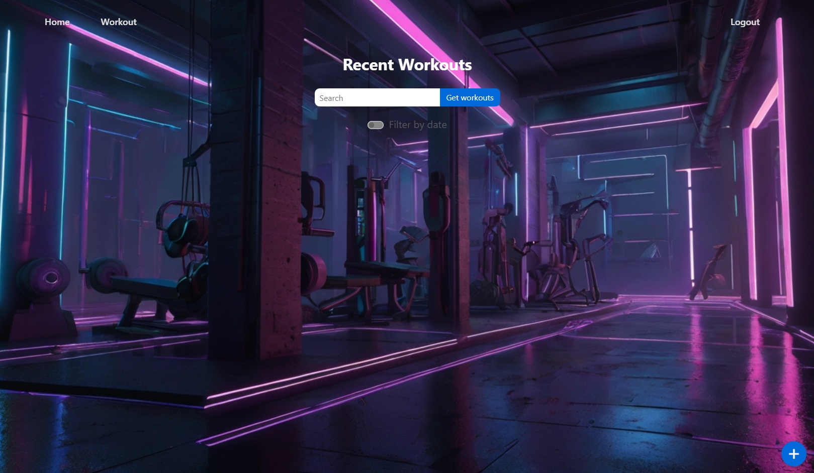
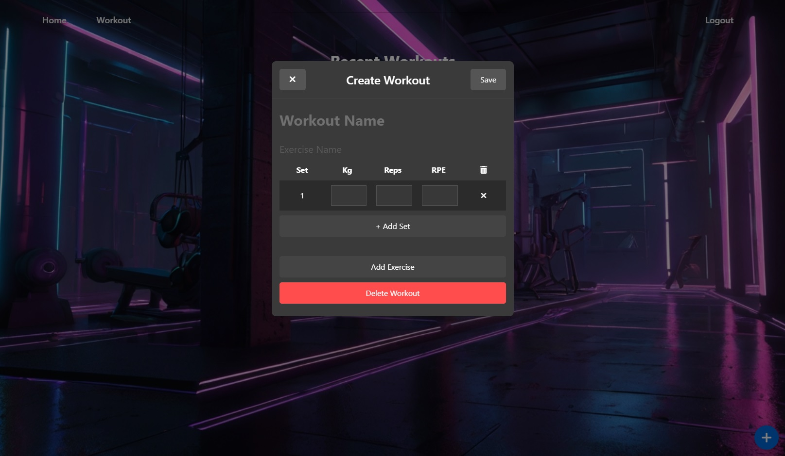
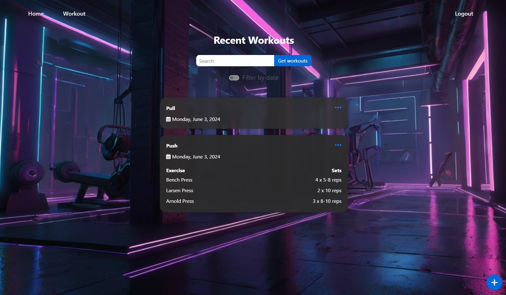

# Gym Workout Logger
## Overview
Gym Workout Logger is a web application that allows users to create an account and log their workouts during gym sessions. This project is a work in progress and aims to provide a simple and effective way for users to track their fitness activities.

## Features
- **User Registration**: Create an account to start logging workouts.
- **User Authentication**: Secure login system.
- **Workout Logging**: Log details of each workout session, including exercises, sets, reps, weights and RPE.

## Tech Stack
- **Frontend**: HTML, CSS, TypeScript, Angular
- **Backend**: C#
- **Database**: Microsoft SQL Server
- **Authentication**: JWT

### Usage

1. **Register a New Account**
    - Go to the registration page and create a new account.

2. **Log In**
    - Log in with your registered credentials or sign in with google.

3. **Log Workouts**
    - Navigate to the workout logging section.
    - Enter the details of your workout session (exercises, sets, reps, weights, RPE) and save.


## Installation and Setup

### Prerequisites
- Docker and Docker Compose installed on your machine.
- Environment variables for Google OAuth and JWT secrets.

### Environment Variables
Create a file named `.env` in the root directory of the project with the following content:

```env
OAUTH_CLIENT_ID=your_google_client_id
OAUTH_CLIENT_SECRET=your_google_client_secret
JWT_SECRET=your_jwt_secret
JWT_ISSUER=your_jwt_issuer
JWT_AUDIENCE=your_jwt_audience
```

### Running the Application

1. **Clone the Repository**
    ```sh
    git clone https://github.com/cosmindevelops/fitness-tracker.git
    cd fitness-tracker
    ```

2. **Set Up Docker Containers**
    ```sh
    docker-compose build
    docker-compose up -d
    ```

3. **Access the Application**
    - Frontend: Open your browser and navigate to `http://localhost:8080`
    - Backend API: The backend API will be running at `http://localhost:5000`

## Screenshots


<br>


<br>



<br>



<br>



